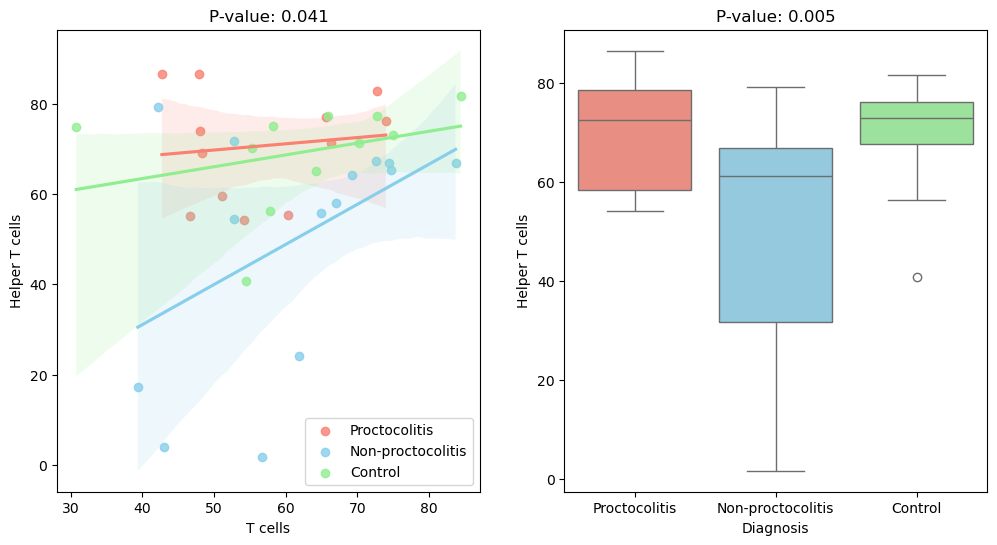

# ANCOVA Analysis Package

### By Germán Vallejo Palma

This Python package provides an intuitive framework for performing parametric and non-parametric ANCOVA (Analysis of Covariance) with the ability to handle multiple levels of categorical variables and covariate interactions. Designed for flexibility, it allows users to assess the influence of both continuous and categorical predictors on a response variable, taking into account normality and homoscedasticity.

### Key Features
- **Flexible Model Generation**: Dynamically generates ANCOVA formulas based on specified categorical variables, covariates, and optional interactions.
- **Assumption Testing**: Includes Shapiro-Wilk and Levene's tests to verify data normality and homoscedasticity, with fallback to non-parametric ANCOVA for violations.
- **Detailed Visualization**: Optionally produces plots illustrating group regressions and box plots, with customizable colors and significant p-values for visual inspection.
- **Customizable Interactions**: Supports user-defined interaction terms or all-possible interactions among covariates.

### Outputs
The package returns:
- **Model Summary**: A dictionary containing critical details of the ANCOVA run, such as variable names, normality and homoscedasticity test results, and sample size.
- **ANOVA Table**: An ANOVA table summarizing the main effects and interactions from the ANCOVA analysis.
- **Plot**: Optional plots of the results, saved if a file path is provided.

### Installation
No external installation required. Make sure to have dependencies: `numpy`, `pandas`, `scipy`, `statsmodels`, `matplotlib`, `seaborn`.

### Usage
```python
# Example usage
results, anova_results = do_ancova(data=df, interactions="ALL", plot=True, save_plot="ancova_plot.png")
```

## AN EXAMPLE OF THE RESULTING PLOT


